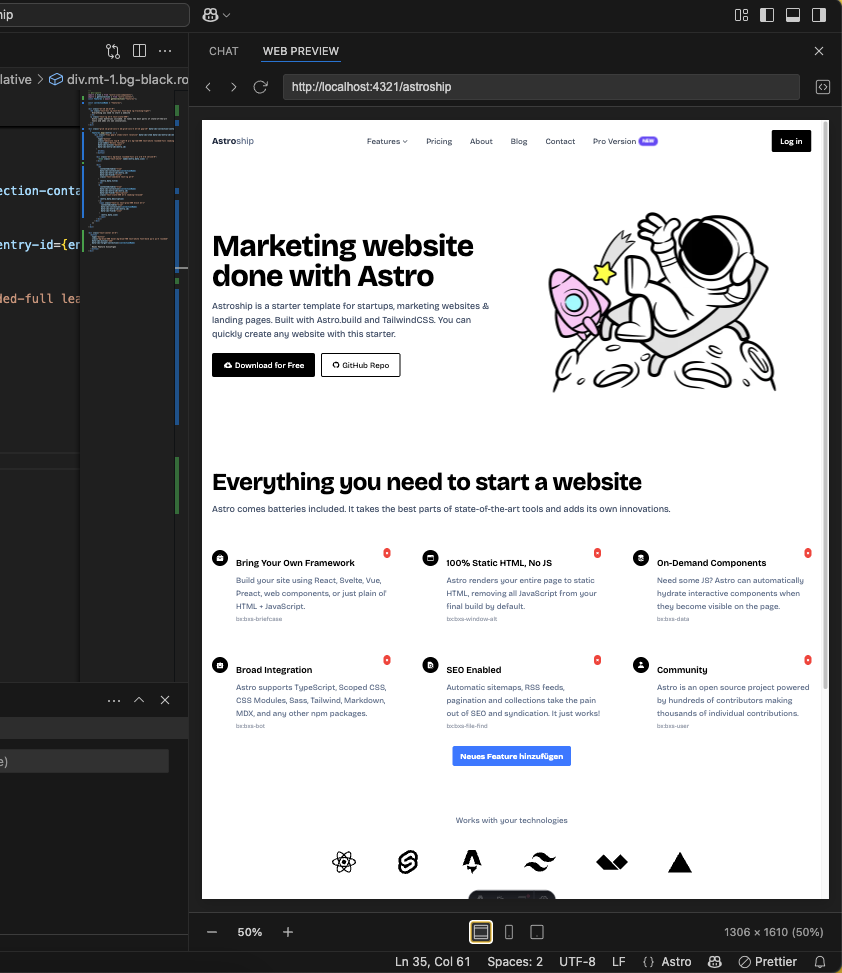
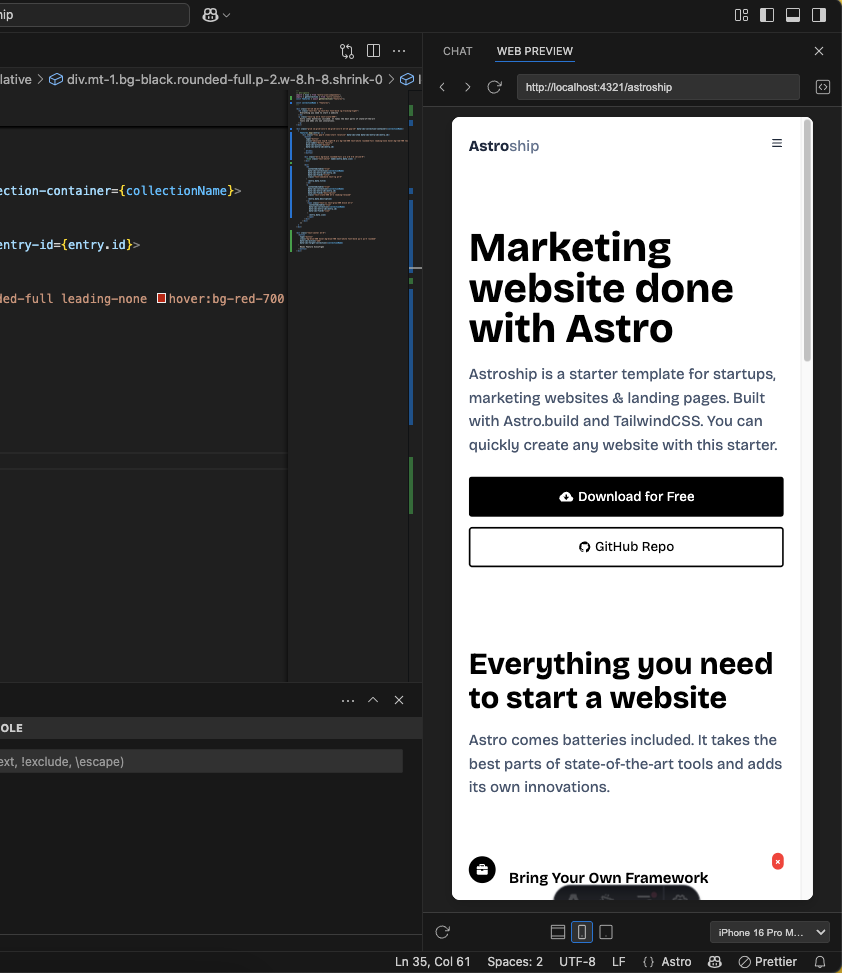

# Web Browser Preview

Preview local websites directly in VS Code with responsive design testing capabilities.

## Features

- 🌐 **Built-in Web Browser** - Browse and test local websites without leaving your editor
- 📱 **Responsive Design Testing** - Test your web applications across multiple device sizes
- 📱 **Device Emulation** - Realistic device frames for popular smartphones and tablets
- 🔄 **Navigation Controls** - Back, forward, reload, and URL input
- 🔍 **Zoom Control** - Adjust zoom level for better viewing
- 🔄 **Device Rotation** - Switch between portrait and landscape orientations
- 💾 **Session Persistence** - Your browsing state is preserved between sessions

## Getting Started

1. Open the browser: Press `Alt+W` or click the Web Preview icon in the activity bar
2. Enter a URL in the address bar or use the command palette: `Web Browser Preview: Open URL`
3. Select your preferred view mode (Responsive, Mobile, or Tablet)
4. For device-specific testing, choose a device from the dropdown menu

## Responsive View

The browser automatically adjusts to fit the panel size and includes zoom controls for precise viewing.

## Mobile/Tablet View

Easily test how your website looks on specific device sizes with proper device frames and orientation controls.

## Device Presets

Test your local websites on accurate screen sizes for the latest devices:

### Mobile Devices
- iPhone SE (3rd gen)
- Samsung Galaxy S25
- iPhone 16 Pro
- Google Pixel 9
- Samsung Galaxy S25 Ultra
- iPhone 16 Pro Max

### Tablets
- iPad Mini (6th gen)
- Samsung Galaxy Tab S10 (11")
- iPad Air 11" (M2)
- Samsung Galaxy Tab S10 Ultra
- iPad Pro 13" (M4)

## Additional Features

- **Development Tools** - Quick access to web development tools
- **State Preservation** - Browser state is preserved between sessions

## Requirements

- Visual Studio Code ^1.80.0

